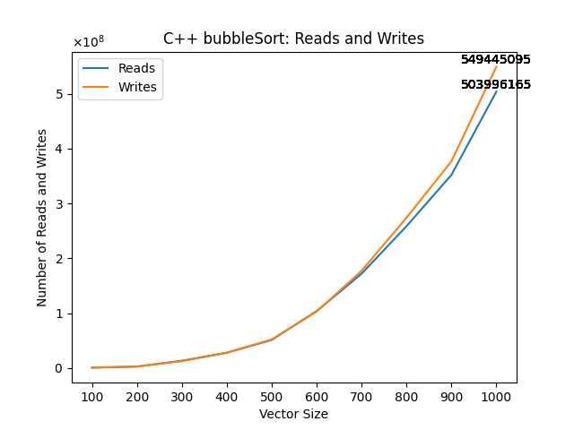
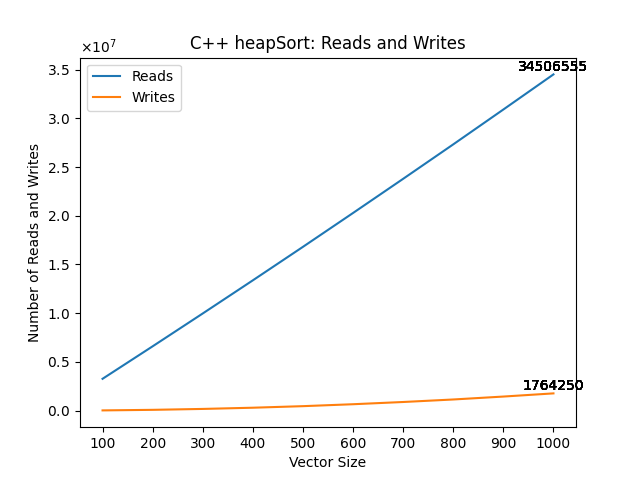
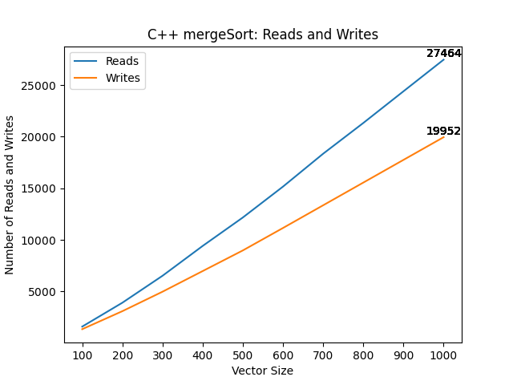
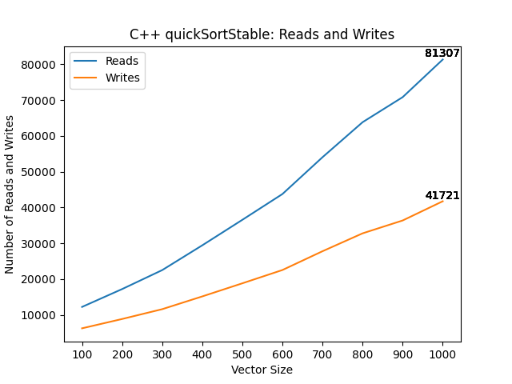
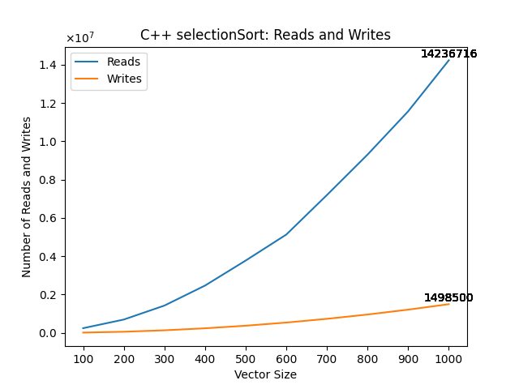

# Automating CS124 Project 4 with Python - Steven De Jesus and Ben Payson

Code Written by me:

Code written by Ben:

All sorting algorithms provided by Lisa Dion, professor of Data Structures and Algorithms at UVM, with my contributions being the reads and writes.

Updated an old C++ project that recorded the number of reads (accessing data) and writes (mutating the data) for different 
sorting algorithms to automatically create graphs from the data outputted, rather than creating each graph myself.

Old C++ Project: Analyzing the amount of reads and writes over a vector (list) size of 100, 200, up until 1000, to see how it grows. 
Algorithms being analyzed: Bubble sort, insertion sort, selection sort, quick sort, radix sort, heap sort, merge sort.

Python Update:
  Updated the old project to write the output of data to a txt file rather than the console, then used Python to read the data from
  the file, and used matplotlib library to plot the data into graphs, and automatically saved them into a folder of images, where they
  are embedded into the readme file.

Technologies: Python, Matplotlib library, C++

# Notable Changes:
1. Graphs below are automated, and citations are updated as well.

Below will be the rest of the README from CS2240's project. In this project, the applied project,
we are comparing the number of reads and writes each sorting algorithm produces when the vector size is as small as 100 and as large as 1000. 
A read is when a piece of data is simply accessed or viewed, and a write is when a piece of data is mutated or created. 
First, we wrote the results of each sorting algorithm in output files for each distinct vector size, in different folder for each algorithm under the
parent folder "data". Then, using python, we created graphs for each sorting algorithm to display how the number of reads and writes grows as the
vector size grows as well. After displaying them, the graphs are saved under the images folder, and then displayed on this file below.

The program doesn't work well on Ben's machine, just mine. In the code, all the calls to the data and images folder are prefixed
with "../" due to the executable running in the cmake-build-debug folder, which is one layer deeper than the data and images folder.

While running the program, I came across errors with the python environment where the executable was running, which prevented me from
using matplotlib since it wasn't installed in that distinct environment, so you might have to install matplotlib if you don't have it
in the environment in which the program is running. You can also run the commented out block in Graph.py, starting with
"import subprocess" to install matplotlib in the current environment.

* The code not authored by myself or Ben: code used to create directories in C++ with <filesystem> and filesystem::create_directory in main.cpp.
  * Source: "https://en.cppreference.com/w/cpp/filesystem/create_directory".
* Another piece of code not authored by myself was in graph.py, where I used "import subprocess" and subprocess.check_call() in order to install matplotlib in whichever environment the executable was running in.
  * Source: "https://docs.python.org/3/library/subprocess.html".

# Old Project:

* Example code:
  ```cpp
  if (vec[i] > vec[i+1]) // This counts as two reads, which should
      // be counted whether the if statements evaluates to true or false.
  Comparable temp = vec[i]; // This is one read.
  smaller.push_back(vec[i]); // This is one read.
  ```
Modify each sorting algorithm to record the number of writes. This is the number of times you assign into a Comparable object. This could be to store a temporary Comparable, to overwrite an item in a Comparable vector, to push_back onto a Comparable vector, etc.
* Example code:
  ```cpp
  Comparable temp = vec[i]; // This is one write (and one read).
  smaller.push_back(vec[i]); // This is one write (and one read).
  vec[i] = vec[i+1]; // This is one write (and one read).
  ```
Use a loop to record the number of reads and writes needed to sort a vector of size 100, 200, 300, 400, 500, 600, 700, 800, 900, and 1000.
* Hint: start with 1000 and then use the resize method to make it smaller. 

## Report
Include the following in this section of your README.md file:
* Information about data set.
  * My data set is a large set of food reviews from Amazon. The 5 attributes are Product ID, User ID, Profile Name, Score, and Summary. The unique attributes are User ID, Profile Name, and Summary. I got the data from the SNAP Stanford Edu website, where many large datasets from different sectors are available. The link is: http://snap.stanford.edu/data/index.html. I chose this data set because it seemed fun to have many Amazon food reviews as my data set. It also seemed like one of the better formatted ones on the website, despite the formatting still being more difficult to read than say the lecturers.csv file. By default, the entries are ordered line by line, with the attribute description on the left. Like so:
      * "Product/ProductId: BLANK123"
      * "Review/UserId: BlANK123" and so on.
  * The object element being compared in this project is the time, which is an attribute not previously used in other projects, but used for this one due to its unique quality and simplicity in comparisons. It's displayed in seconds (Epoch), and the comparisons are based on the magnitude of each number. The larger number would be the larger value of time in Epoch, so the more time elapsed, so the more recent time. The second attribute being used is score, which is a non-unique attribute that describes the score, out of 5, which a reviewer gave for a product.

# GRAPHS:
  * 
  * 
  * 
  * 
  * 
  * 
  * 
