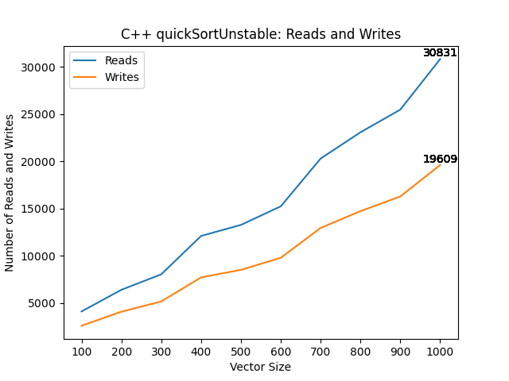

# CS 2300: Automating CS124 Project 4 with Python
# Notable Changes:
1. Graphs below are automated, and citations are updated as well.

Below will be the rest of the README from CS2240's project. In this project, the applied project,
we are comparing the number of reads and writes each sorting algorithm produces when the vector size is as small as 100 and as large as 1000. 
A read is when a piece of data is simply accessed or viewed, and a write is when a piece of data is mutated or created. 
First, we wrote the results of each sorting algorithm in output files for each distinct vector size, in different folder for each algorithm under the
parent folder "data". Then, using python, we created graphs for each sorting algorithm to display how the number of reads and writes grows as the
vector size grows as well. After displaying them, the graphs are saved under the images folder, and then displayed on this file below.

The program doesn't work well on Ben's machine, just mine. In the code, all the calls to the data and images folder are prefixed
with "../" due to the executable running in the cmake-build-debug folder, which is one layer deeper than the data and images folder.

While running the program, I came across errors with the python environment where the executable was running, which prevented me from
using matplotlib since it wasn't installed in that distinct environment, so you might have to install matplotlib if you don't have it
in the environment in which the program is running. You can also run the commented out block in Graph.py, starting with
"import subprocess" to install matplotlib in the current environment.

* The only code not authored by myself was code used to create directories in C++ with <filesystem> and filesystem::create_directory in main.cpp.
  * Source: "https://en.cppreference.com/w/cpp/filesystem/create_directory".
* Another piece of code not authored by myself was in graph.py, where I used "import subprocess" and subprocess.check_call() in order to install matplotlib in whichever environment the executable was running in.
  * Source: "https://docs.python.org/3/library/subprocess.html".

Old Project:

Modify each sorting algorithm to record the number of reads. This is the number of times you use a Comparable object. This could be using it to store somewhere else, using it to compare to another object, etc. Temporary Comparable objects count towards the reads. 

* Example code:
  ```cpp
  if (vec[i] > vec[i+1]) // This counts as two reads, which should
      // be counted whether the if statements evaluates to true or false.
  Comparable temp = vec[i]; // This is one read.
  smaller.push_back(vec[i]); // This is one read.
  ```
Modify each sorting algorithm to record the number of writes. This is the number of times you assign into a Comparable object. This could be to store a temporary Comparable, to overwrite an item in a Comparable vector, to push_back onto a Comparable vector, etc.
* Example code:
  ```cpp
  Comparable temp = vec[i]; // This is one write (and one read).
  smaller.push_back(vec[i]); // This is one write (and one read).
  vec[i] = vec[i+1]; // This is one write (and one read).
  ```
Use a loop to record the number of reads and writes needed to sort a vector of size 100, 200, 300, 400, 500, 600, 700, 800, 900, and 1000.
* Hint: start with 1000 and then use the resize method to make it smaller. 

## Report
Include the following in this section of your README.md file:
* Information about your data set (you will be assigned a different grader for this project).
  * My data set is a large set of food reviews from Amazon. The 5 attributes are Product ID, User ID, Profile Name, Score, and Summary. The unique attributes are User ID, Profile Name, and Summary. I got the data from the SNAP Stanford Edu website, where many large datasets from different sectors are available. The link is: http://snap.stanford.edu/data/index.html. I chose this data set because it seemed fun to have many Amazon food reviews as my data set. It also seemed like one of the better formatted ones on the website, despite the formatting still being more difficult to read than say the lecturers.csv file. By default, the entries are ordered line by line, with the attribute description on the left. Like so:
      * "Product/ProductId: BLANK123"
      * "Review/UserId: BlANK123" and so on.
  * The object element being compared in this project is the time, which is an attribute not previously used in other projects, but used for this one due to its unique quality and simplicity in comparisons. It's displayed in seconds (Epoch), and the comparisons are based on the magnitude of each number. The larger number would be the larger value of time in Epoch, so the more time elapsed, so the more recent time. The second attribute being used is score, which is a non-unique attribute that describes the score, out of 5, which a reviewer gave for a product.

* Analyze the data. Graph the number of reads and writes for each sorting algorithm and look at how the number of reads and writes grows when the size of the data set grows. Compare and contrast the different sorting algorithms and draw conclusions about which sorting algorithms are more efficient. Discuss complexities and their effects.
  * 
  * 
  * 
  * 
  * 
  * 
  * 

    * Of all these algorithms, bubble sort is the least space efficient and likely the least time efficient as well, as it seems to have a quadratic time complexity and the number of reads and writes is the largest of all algorithms. This represents how many times comparable objects are accessed and written into, and the more efficient algorithm minimizes the reads and writes to save time and space. Bubble sort is inefficient because as elements grow in a bubble sort, the algorithm has to reread already sorted elements, which is largely inefficient for a large dataset, since every element has to be interacted with. Next, while the selection sort is efficient for smaller datasets, it loses efficiency for larger datasets for the same reason that bubble sort does, because it has to read the entire dataset, including already sorted elements. While there are still many reads, it is much less than the bubble sort, so it is more efficient. It also seems to have a more linear space and time complexity rather than quadratic with bubble sort. Next is insertion sort, which exponentially grows in space and time as the number of reads and writes increases exponentially while the vector grows. For larger datasets, it is less efficient than selection sort, but still more efficient than bubble sort. Next is merge sort, which is the most efficient sorting algorithm thus far as it is stable, minimizes the amount of reads and writes necessary to sort, and has a strictly linear complexity (thus far). Next is the stable quick sort, which seems less efficient than merge sort, but more efficient than the bubble, insertion and selection sort due to its linear nature which is better suited for large datasets than the exponential nature of the other algorithms. The ratio of writes to reads is very low, which may indicate inefficiency as there are many more empty reads than necessary for writes. The unstable quick sort is very efficient in terms of space and time, as the reads and writes are low, and the ratio of reads to writes is more even than in other algorithms, showing less empty reads. However, the drawback is the lack of stability. The heap sort is efficient in space complexity and it seems to have a constant complexity, as the writes remain fairly constant as the vector grows. In terms of reads, its rate of growth is fairly linear, which makes it more efficient than other algorithms that grow more exponentially. The time complexity seems to be close to linear, based off the reads. Finally, for the two sort, it seems very quick and efficient in terms of complexities due to its linear nature and low number of reads and writes. It is only half stable though, since I used unstable quick sort for one attribute and merge sort for another. As a result, this sorting algorithm works very similar to those two.

* Answers to the following questions:
  * If you need to sort a contacts list on a mobile app, which sorting algorithm(s) would you use and why?
    * If I need to sort a contacts list, I would use insertion sort because a contacts list is a small data set, and the insertion sort works best on smaller data sets. The nature of a contacts list, where one entry is inserted as a time, makes the insertion sort a perfect fit as it is a comparison sort in which the sorted array is built one entry at a time.
  * What about if you need to sort a database of 20 million client files that are stored in a datacenter in the cloud?
    * Since the amount of data you need to sort is so large, it would exceed any given space to sort it completely like with most sorting algorithms. As a result, the best sorting algorithm for this task is the merge, as we can divide the data set into smaller chunks, and sort those chunks first and then merge them together. You can sort those chunks of data at the same time with parallel processes, which should speed up the sorting process and keep efficiency.
